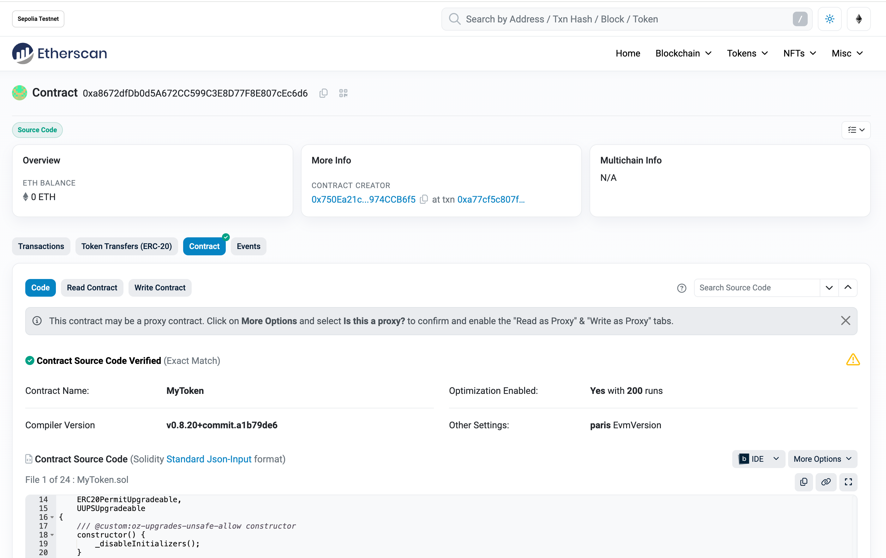
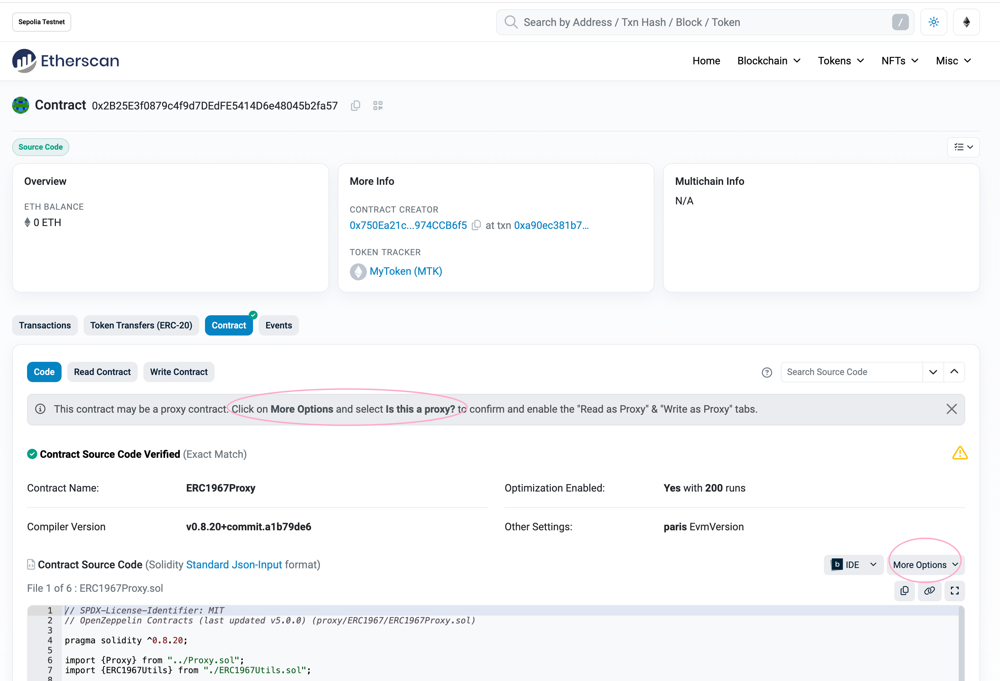
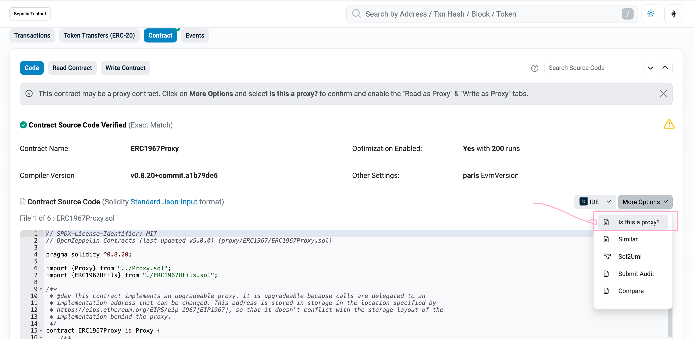
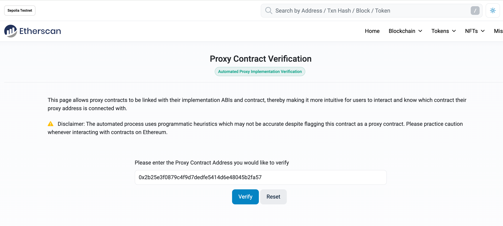
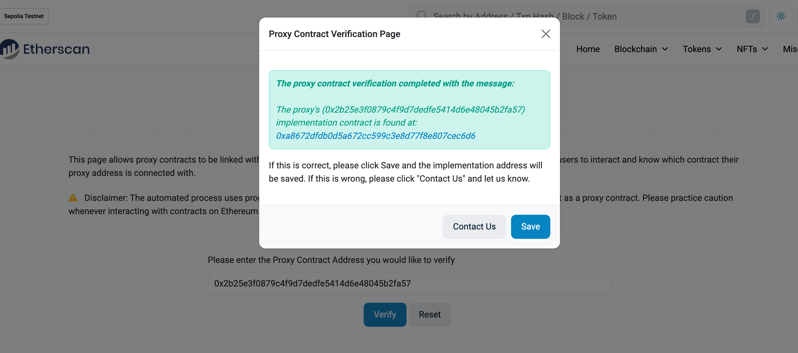
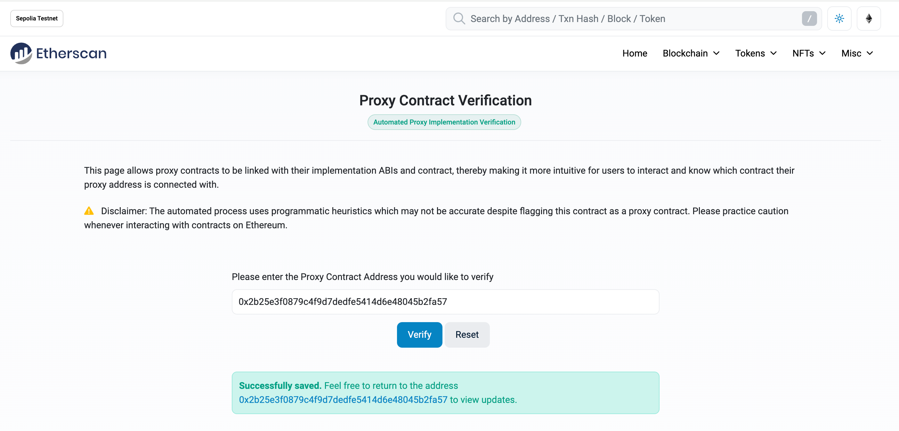
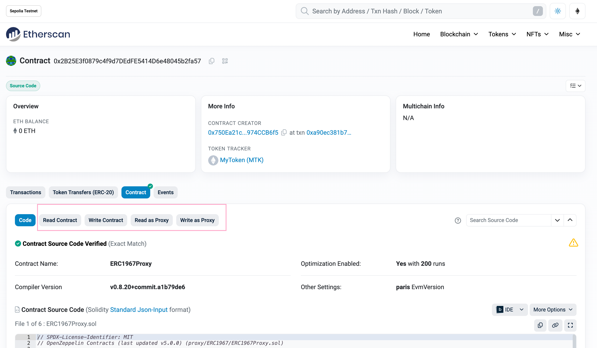
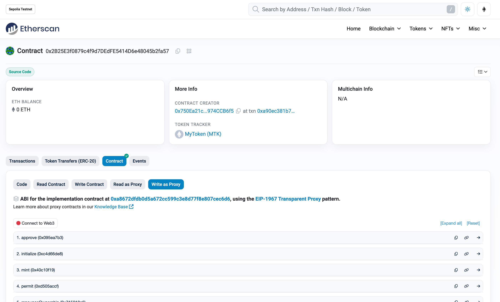

# Deploying

## Deploying to Contract

### 部署 MyToken 合约

```bash
erc20_upgradeable on  master [!+?] via 🅒 base 
➜ source .env    

erc20_upgradeable on  master [!+?] via 🅒 base 
➜ forge script --chain sepolia DeployTokenImplementation --rpc-url $SEPOLIA_RPC_URL --account MetaMask --broadcast --verify -vvvv

[⠒] Compiling...
[⠔] Compiling 1 files with Solc 0.8.20
[⠒] Solc 0.8.20 finished in 1.31s
Compiler run successful!
Enter keystore password:
Traces:
  [1550301] DeployTokenImplementation::run()
    ├─ [0] VM::startBroadcast()
    │   └─ ← [Return] 
    ├─ [1510135] → new MyToken@0xa8672dfDb0d5A672CC599C3E8D77F8E807cEc6d6
    │   ├─ emit Initialized(version: 18446744073709551615 [1.844e19])
    │   └─ ← [Return] 7425 bytes of code
    ├─ [0] VM::stopBroadcast()
    │   └─ ← [Return] 
    ├─ [0] console::log("Token Implementation Address:", MyToken: [0xa8672dfDb0d5A672CC599C3E8D77F8E807cEc6d6]) [staticcall]
    │   └─ ← [Stop] 
    └─ ← [Stop] 


Script ran successfully.

== Logs ==
  Token Implementation Address: 0xa8672dfDb0d5A672CC599C3E8D77F8E807cEc6d6

## Setting up 1 EVM.
==========================
Simulated On-chain Traces:

  [1510135] → new MyToken@0xa8672dfDb0d5A672CC599C3E8D77F8E807cEc6d6
    ├─ emit Initialized(version: 18446744073709551615 [1.844e19])
    └─ ← [Return] 7425 bytes of code


==========================

Chain 11155111

Estimated gas price: 13.11601001 gwei

Estimated total gas used for script: 2187222

Estimated amount required: 0.02868762564609222 ETH

==========================

##### sepolia
✅  [Success]Hash: 0xa77cf5c807f186b946901476c5ce2ac4463e3c488d34bf7ff20855aff574adb4
Contract Address: 0xa8672dfDb0d5A672CC599C3E8D77F8E807cEc6d6
Block: 6383504
Paid: 0.011464523319827553 ETH (1682959 gas * 6.812122767 gwei)

✅ Sequence #1 on sepolia | Total Paid: 0.011464523319827553 ETH (1682959 gas * avg 6.812122767 gwei)
                                                                                                                     

==========================

ONCHAIN EXECUTION COMPLETE & SUCCESSFUL.
##
Start verification for (1) contracts
Start verifying contract `0xa8672dfDb0d5A672CC599C3E8D77F8E807cEc6d6` deployed on sepolia

Submitting verification for [src/MyToken.sol:MyToken] 0xa8672dfDb0d5A672CC599C3E8D77F8E807cEc6d6.
Submitted contract for verification:
        Response: `OK`
        GUID: `fbeu59cj18en9niqspnsmfgtkds6wc489dc3zvdby4txtfjn1d`
        URL: https://sepolia.etherscan.io/address/0xa8672dfdb0d5a672cc599c3e8d77f8e807cec6d6
Contract verification status:
Response: `NOTOK`
Details: `Pending in queue`
Contract verification status:
Response: `OK`
Details: `Pass - Verified`
Contract successfully verified
All (1) contracts were verified!

Transactions saved to: /Users/qiaopengjun/Code/solidity-code/erc20_upgradeable/broadcast/deployToken.s.sol/11155111/run-latest.json

Sensitive values saved to: /Users/qiaopengjun/Code/solidity-code/erc20_upgradeable/cache/deployToken.s.sol/11155111/run-latest.json


erc20_upgradeable on  master [!+?] via 🅒 base took 1m 9.4s 
➜ 
```

https://sepolia.etherscan.io/address/0xa8672dfdb0d5a672cc599c3e8d77f8e807cec6d6#code



### 部署代理合约

```shell
erc20_upgradeable on  master [!+?] via 🅒 base took 1m 9.4s 
➜ forge script --chain sepolia DeployUUPSProxy --rpc-url $SEPOLIA_RPC_URL --account MetaMask --broadcast --verify -vvvv

[⠒] Compiling...
[⠒] Compiling 1 files with Solc 0.8.20
[⠑] Solc 0.8.20 finished in 1.39s
Compiler run successful!
Enter keystore password:
Traces:
  [292201] DeployUUPSProxy::run()
    ├─ [0] VM::startBroadcast()
    │   └─ ← [Return] 
    ├─ [252732] → new ERC1967Proxy@0x2B25E3f0879c4f9d7DEdFE5414D6e48045b2fa57
    │   ├─ emit Upgraded(implementation: MetaMultiSigWallet: [0xa8672dfDb0d5A672CC599C3E8D77F8E807cEc6d6])
    │   ├─ [191066] MetaMultiSigWallet::initialize(DefaultSender: [0x1804c8AB1F12E6bbf3894d4083f33e07309d1f38]) [delegatecall]
    │   │   ├─ emit OwnershipTransferred(previousOwner: 0x0000000000000000000000000000000000000000, newOwner: DefaultSender: [0x1804c8AB1F12E6bbf3894d4083f33e07309d1f38])
    │   │   ├─ emit Transfer(from: 0x0000000000000000000000000000000000000000, to: 0x750Ea21c1e98CcED0d4557196B6f4a5974CCB6f5, value: 1000000000000000000000000 [1e24])
    │   │   ├─ emit Initialized(version: 1)
    │   │   └─ ← [Stop] 
    │   └─ ← [Return] 170 bytes of code
    ├─ [0] VM::stopBroadcast()
    │   └─ ← [Return] 
    ├─ [0] console::log("UUPS Proxy Address:", ERC1967Proxy: [0x2B25E3f0879c4f9d7DEdFE5414D6e48045b2fa57]) [staticcall]
    │   └─ ← [Stop] 
    └─ ← [Stop] 


Script ran successfully.

== Logs ==
  UUPS Proxy Address: 0x2B25E3f0879c4f9d7DEdFE5414D6e48045b2fa57

## Setting up 1 EVM.
==========================
Simulated On-chain Traces:

  [252732] → new ERC1967Proxy@0x2B25E3f0879c4f9d7DEdFE5414D6e48045b2fa57
    ├─ emit Upgraded(implementation: MetaMultiSigWallet: [0xa8672dfDb0d5A672CC599C3E8D77F8E807cEc6d6])
    ├─ [191066] MetaMultiSigWallet::initialize(DefaultSender: [0x1804c8AB1F12E6bbf3894d4083f33e07309d1f38]) [delegatecall]
    │   ├─ emit OwnershipTransferred(previousOwner: 0x0000000000000000000000000000000000000000, newOwner: DefaultSender: [0x1804c8AB1F12E6bbf3894d4083f33e07309d1f38])
    │   ├─ emit Transfer(from: 0x0000000000000000000000000000000000000000, to: 0x750Ea21c1e98CcED0d4557196B6f4a5974CCB6f5, value: 1000000000000000000000000 [1e24])
    │   ├─ emit Initialized(version: 1)
    │   └─ ← [Stop] 
    └─ ← [Return] 170 bytes of code


==========================

Chain 11155111

Estimated gas price: 13.042522807 gwei

Estimated total gas used for script: 419900

Estimated amount required: 0.0054765553266593 ETH

==========================

##### sepolia
✅  [Success]Hash: 0xa90ec381b7d65e7f0eac86686455f7f63745a87b23905f2d5d5c3e2527bfe18a
Contract Address: 0x2B25E3f0879c4f9d7DEdFE5414D6e48045b2fa57
Block: 6383534
Paid: 0.002326506335158512 ETH (323076 gas * 7.201111612 gwei)

✅ Sequence #1 on sepolia | Total Paid: 0.002326506335158512 ETH (323076 gas * avg 7.201111612 gwei)
                                                                                                                     

==========================

ONCHAIN EXECUTION COMPLETE & SUCCESSFUL.
##
Start verification for (1) contracts
Start verifying contract `0x2B25E3f0879c4f9d7DEdFE5414D6e48045b2fa57` deployed on sepolia

Submitting verification for [lib/openzeppelin-contracts/contracts/proxy/ERC1967/ERC1967Proxy.sol:ERC1967Proxy] 0x2B25E3f0879c4f9d7DEdFE5414D6e48045b2fa57.

Submitting verification for [lib/openzeppelin-contracts/contracts/proxy/ERC1967/ERC1967Proxy.sol:ERC1967Proxy] 0x2B25E3f0879c4f9d7DEdFE5414D6e48045b2fa57.
Submitted contract for verification:
        Response: `OK`
        GUID: `ckaauhv3nixjerfkcgjs2ezkucwuzha2qgggifacazpep5dvje`
        URL: https://sepolia.etherscan.io/address/0x2b25e3f0879c4f9d7dedfe5414d6e48045b2fa57
Contract verification status:
Response: `NOTOK`
Details: `Pending in queue`
Contract verification status:
Response: `OK`
Details: `Pass - Verified`
Contract successfully verified
All (1) contracts were verified!

Transactions saved to: /Users/qiaopengjun/Code/solidity-code/erc20_upgradeable/broadcast/deployProxy.s.sol/11155111/run-latest.json

Sensitive values saved to: /Users/qiaopengjun/Code/solidity-code/erc20_upgradeable/cache/deployProxy.s.sol/11155111/run-latest.json


erc20_upgradeable on  master [!+?] via 🅒 base took 1m 1.6s 
➜
```
<https://sepolia.etherscan.io/address/0x2b25e3f0879c4f9d7dedfe5414d6e48045b2fa57#code>



### 验证合约是否是代理

This contract may be a proxy contract. Click on **More Options** and select **Is this a proxy?** to confirm and enable the "Read as Proxy" & "Write as Proxy" tabs.



#### 进行验证



#### 单击 Verify



#### 单击 Save



#### 成功验证



#### 查看




## 参考

- https://github.com/OpenZeppelin/openzeppelin-foundry-upgrades
- 
